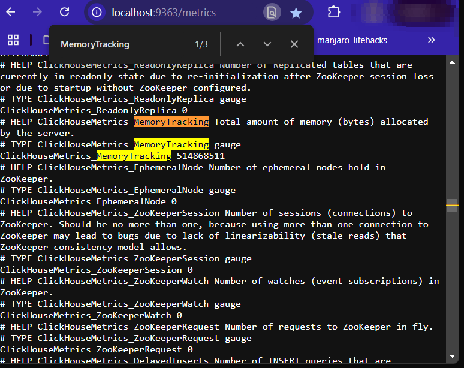
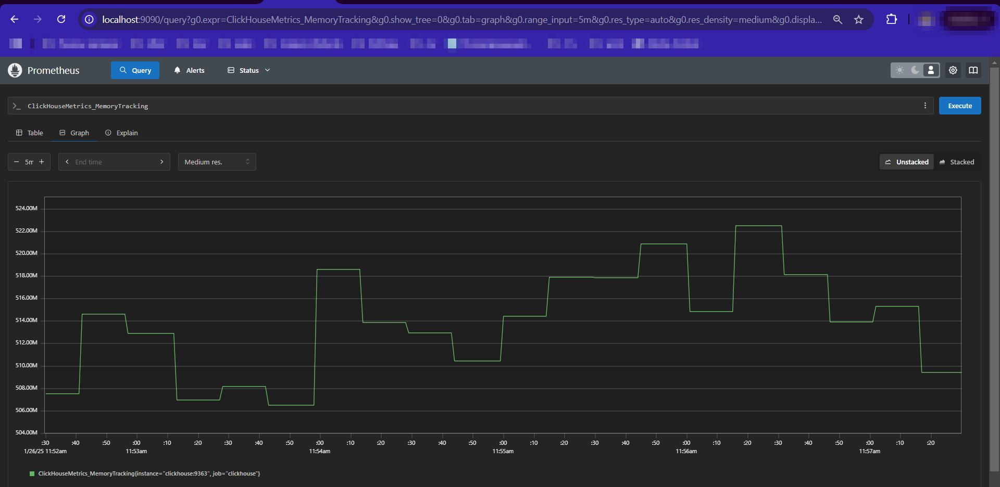

# Отчёт о выполнении задания

## Итоговый `docker-compose.yaml`

```yaml
version: '3.7'

services:
  clickhouse:
    image: yandex/clickhouse-server
    container_name: clickhouse
    ports:
      - "8123:8123"
      - "9000:9000"
      - "9363:9363"
    volumes:
      - clickhouse_data:/var/lib/clickhouse
      - ./clickhouse-config.xml:/etc/clickhouse-server/config.d/metrics.xml
    environment:
      - CLICKHOUSE_DB=test
      - CLICKHOUSE_USER=admin
      - CLICKHOUSE_PASSWORD=admin
    networks:
      - monitoring_net

  prometheus:
    image: prom/prometheus
    container_name: prometheus
    ports:
      - "9090:9090"
    volumes:
      - ./prometheus.yml:/etc/prometheus/prometheus.yml
    command:
      - '--config.file=/etc/prometheus/prometheus.yml'
    depends_on:
      - clickhouse
    networks:
      - monitoring_net

  graphite:
    image: graphiteapp/graphite-statsd
    container_name: graphite
    ports:
      - "80:80"
      - "2003:2003"
    volumes:
      - graphite_data:/opt/graphite/storage
    networks:
      - monitoring_net

volumes:
  clickhouse_data:
  graphite_data:

networks:
  monitoring_net:
```

## Конфигурационные файлы

### `clickhouse-config.xml`

```xml
<yandex>
  <prometheus>
    <endpoint>/metrics</endpoint>
    <port>9363</port>
    <metrics>true</metrics>
    <events>true</events>
    <asynchronous_metrics>true</asynchronous_metrics>
  </prometheus>
</yandex>
```

### `prometheus.yml`

```yaml
global:
  scrape_interval: 15s

scrape_configs:
  - job_name: 'clickhouse'
    static_configs:
      - targets: ['clickhouse:9363']
```

## Результат выполнения установки

```bash
# docker-compose up -d
Creating network "user_monitoring_net" with the default driver
Pulling clickhouse (yandex/clickhouse-server:)...
latest: Pulling from yandex/clickhouse-server
ea362f368469: Pull complete
38ba82a23e2b: Pull complete
9b17d04b6c62: Pull complete
5658714e4e8b: Pull complete
6bde977a0bf8: Pull complete
39053b27290b: Pull complete
762d3d237065: Pull complete
Digest: sha256:1cbf75aabe1e2cc9f62d1d9929c318a59ae552e2700e201db985b92a9bcabc6e
Status: Downloaded newer image for yandex/clickhouse-server:latest
Pulling prometheus (prom/prometheus:)...
latest: Pulling from prom/prometheus
9fa9226be034: Pull complete
1617e25568b2: Pull complete
5223fd66c357: Pull complete
935b618cedfb: Pull complete
343344cc83ef: Pull complete
c5d55cdd4901: Pull complete
bc4feeb9f815: Pull complete
e4517b9a2fa7: Pull complete
8faccf8621bd: Pull complete
21fef47de6b8: Pull complete
Digest: sha256:6559acbd5d770b15bb3c954629ce190ac3cbbdb2b7f1c30f0385c4e05104e218
Status: Downloaded newer image for prom/prometheus:latest
Pulling graphite (graphiteapp/graphite-statsd:)...
latest: Pulling from graphiteapp/graphite-statsd
0cdfa0c98ed7: Pull complete
723656d3099c: Pull complete
620093e6e6f0: Pull complete
fcf6a0ec82d9: Pull complete
f09364cff1fd: Pull complete
Digest: sha256:2d61228771119ddaee2f62d65739d3b5e903de36666e899703e47be1def571fe
Status: Downloaded newer image for graphiteapp/graphite-statsd:latest
Creating clickhouse ... done
Creating graphite   ... done
Creating prometheus ... done
```

## Результат в Prometheus

Для проверки работы метрик был выполнен запрос в Prometheus:

была выбрана одна из метрик памяти 



```promql
ClickHouseMetrics_MemoryTracking
```

Результат выполнения запроса можно увидеть на скриншоте:



---