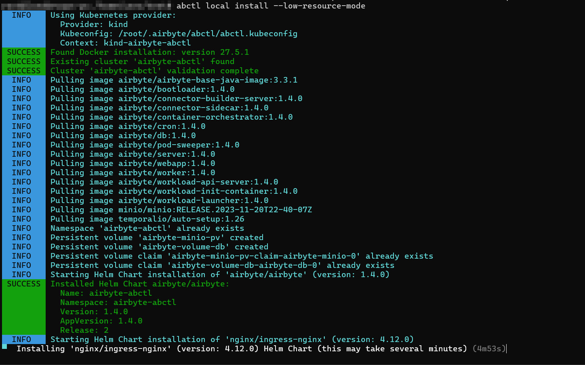
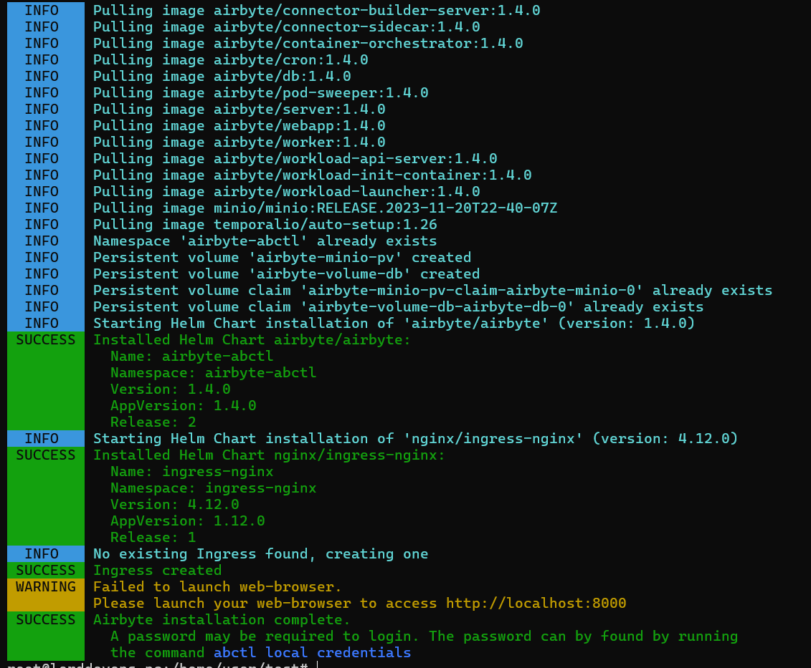
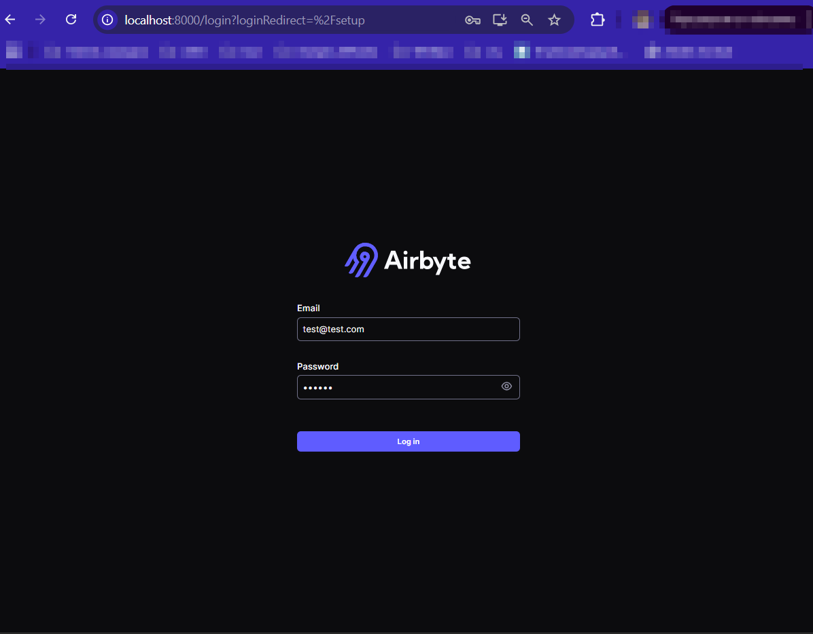
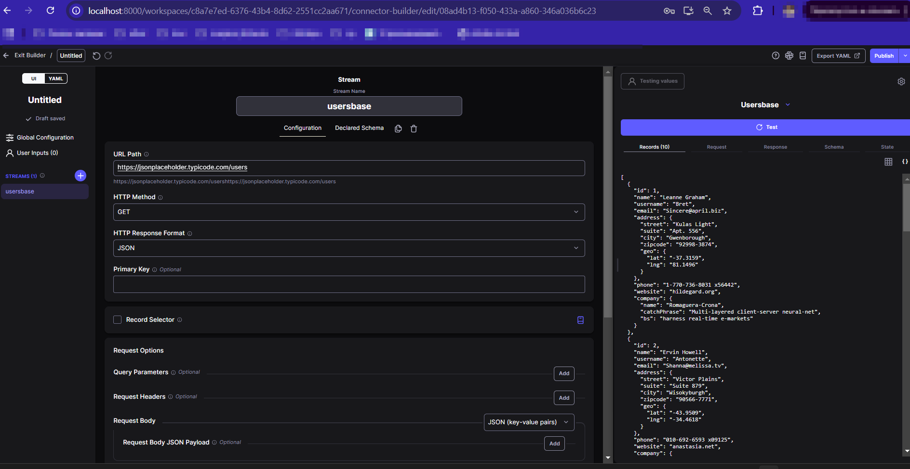
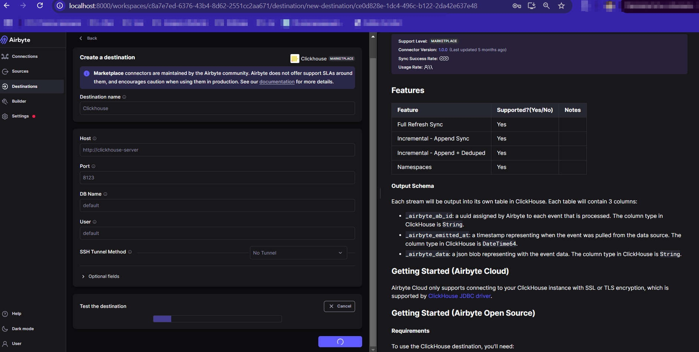
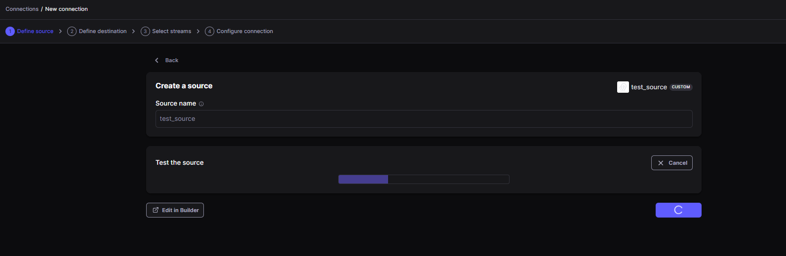
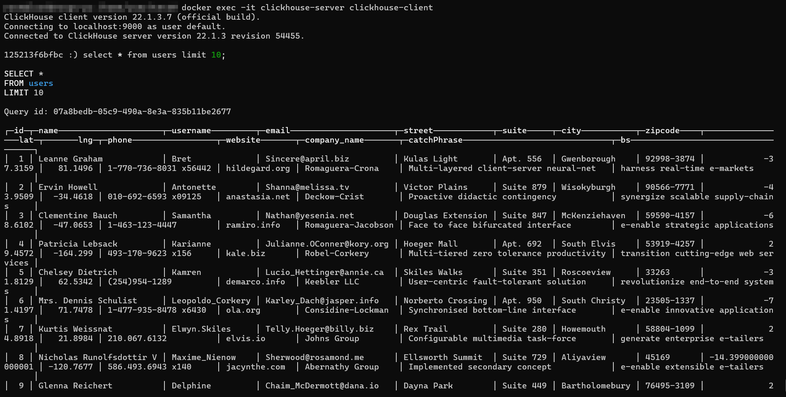

Для выполнения задачи мы будем использовать Airbyte как ETL-инструмент и ClickHouse как БД-приемник.
гайд по разворачиванию Airbyte:
https://docs.airbyte.com/using-airbyte/getting-started/oss-quickstart#install-abctl-the-fast-way-mac-linux

2. Откройте веб-интерфейс Airbyte по адресу http://localhost:8000



почту вводим любую, pwd вернёт команда
```bash
abctl local credentials
```
3. Настройка источника данных (Source):
API через url https://jsonplaceholder.typicode.com/users


4. Настройка приемника данных (Destination):
- Нажмите "Add destination"
- Выберите ClickHouse
- Заполните параметры подключения:
  * Host: clickhouse
  * Port: 8123
  * Database: default
  * Username: default
  * Password: оставить пустым


5. Создание синхронизации:
- Нажмите "Create connection"
- Выберите настроенный Source и Destination
- Выберите таблицы/коллекции для синхронизации
- Настройте режим синхронизации (полная/инкрементальная)
- Установите расписание выполнения


6. Проверка данных в ClickHouse:

