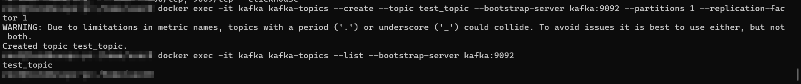
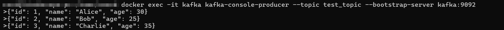

# Интеграция ClickHouse с Apache Kafka
## Установка


Запустите [docker-compose.yml](docker-compose.yml):

```bash
docker-compose up -d
```

После запуска вы должны иметь следующие сервисы:
- Zookeeper (`localhost:2181`)
- Kafka (`localhost:9092`)
- ClickHouse (`localhost:8123` и `localhost:9000`)

---

## Настройка Kafka

### Создание топика Kafka

Создайте топик Kafka для тестирования:

```bash
docker exec -it kafka kafka-topics --create --topic test_topic --bootstrap-server kafka:9092 --partitions 1 --replication-factor 1
```

Проверьте, что топик создан:

```bash
docker exec -it kafka kafka-topics --list --bootstrap-server kafka:9092
```

### Производитель (Producer)

Запустите производителя сообщений для отправки данных в Kafka:

```bash
docker exec -it kafka kafka-console-producer --topic test_topic --bootstrap-server kafka:9092
```

Отправьте несколько строк данных (например, JSON):

```json
{"id": 1, "name": "Alice", "age": 30}
{"id": 2, "name": "Bob", "age": 25}
{"id": 3, "name": "Charlie", "age": 35}
```

Для выхода из консольного производителя нажмите `Ctrl+C`.

---

## Настройка ClickHouse

Подключитесь к ClickHouse:

```bash
clickhouse-client --host localhost
```

### Создание таблиц

#### Таблица Kafka Engine

Создайте таблицу, которая будет читать данные из Kafka:

```sql
CREATE TABLE kafka_table
(
    id UInt64,
    name String,
    age UInt8
) ENGINE = Kafka
SETTINGS
    kafka_broker_list = 'kafka:9092',
    kafka_topic_list = 'test_topic',
    kafka_group_name = 'clickhouse_group',
    kafka_format = 'JSONEachRow';
```

#### Таблица MergeTree

Создайте финальную таблицу для хранения данных:

```sql
CREATE TABLE final_table
(
    id UInt64,
    name String,
    age UInt8
) ENGINE = MergeTree()
ORDER BY id;
```

#### Материализованное представление

Создайте материализованное представление для переноса данных из Kafka Engine в MergeTree:

```sql
CREATE MATERIALIZED VIEW mv_to_final_table TO final_table AS
SELECT id, name, age
FROM kafka_table;
```

---

## Тестирование пайплайна

1. Откройте новое окно терминала и запустите консольного потребителя Kafka для проверки, что данные действительно попадают в топик:

```bash
docker exec -it kafka kafka-console-consumer --topic test_topic --from-beginning --bootstrap-server kafka:9092
```

2. В другом окне терминала подключитесь к ClickHouse и выполните запрос для проверки данных в таблице `final_table`:

```bash
clickhouse-client --host localhost
```

```sql
SELECT * FROM final_table;

┌──id─┬─name────┬─age─┐
│   1 │ Alice   │  30 │
│   2 │ Bob     │  25 │
│   3 │ Charlie │  35 │
└─────┴─────────┴─────┘
```