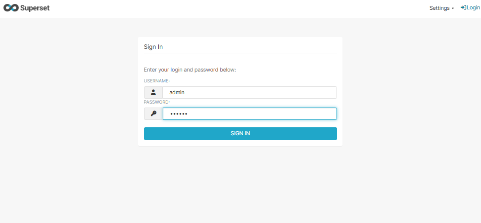
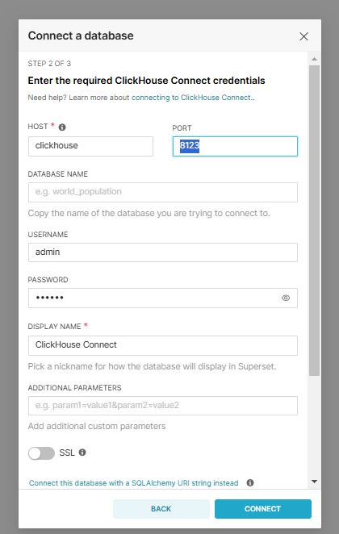
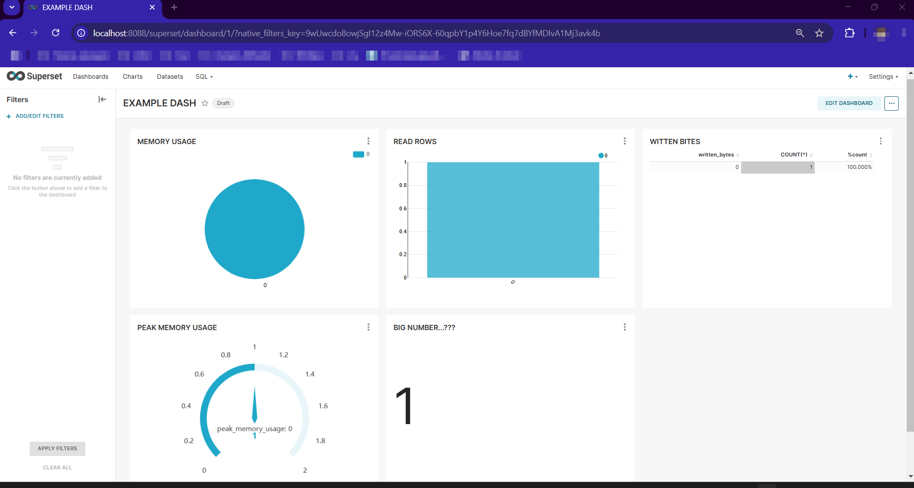

### Пошаговая инструкция по развертыванию:

1. **Запустите контейнеры**:
   Откройте терминал в директории с [docker-compose.yml](docker-compose.yml) и выполните команду:

   ```bash
   docker-compose up -d
   ```

   образ superset будет дополнительно обогощён драйвером для KH на основе гайда 
    https://superset.apache.org/docs/configuration/databases#clickhouse
    ```docker
    RUN pip install --no-cache-dir clickhouse-connect
    ```
2. **Инициализация Superset**:
   После запуска контейнеров выполните следующие команды для инициализации Superset:

   ```bash
   docker exec -it superset superset fab create-admin \
       --username admin \
       --firstname Superset \
       --lastname Admin \
       --email admin@example.com \
       --password Pwd123

   docker exec -it superset superset db upgrade
   docker exec -it superset superset init
   ```

3. **Настройка подключения к ClickHouse**:
   - Откройте Superset в браузере по адресу: [http://localhost:8088](http://localhost:8088).
   
   - Войдите с учётными данными, которые вы создали ранее (admin/Pwd123).
   - Перейдите в раздел **Data > Databases** и добавьте новое подключение к ClickHouse:
     - **SQLAlchemy URI**: `clickhouse://default:@clickhouse:8123/default`
     
     - Убедитесь, что тест подключения проходит успешно.

4. **Создание дашборда**:

Пример на основе базы **system** с различными визуализациями

