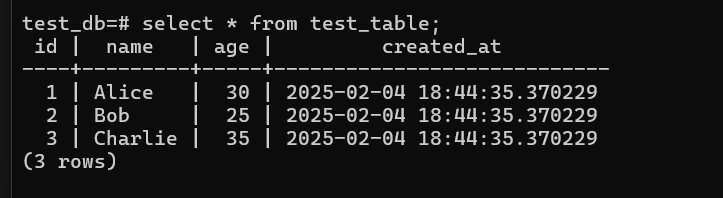
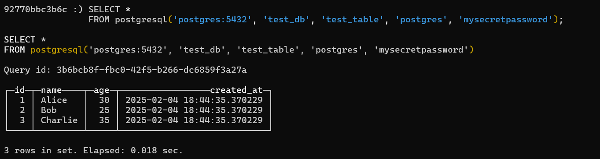
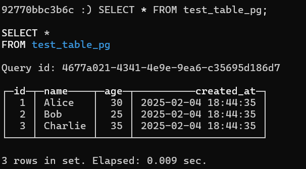
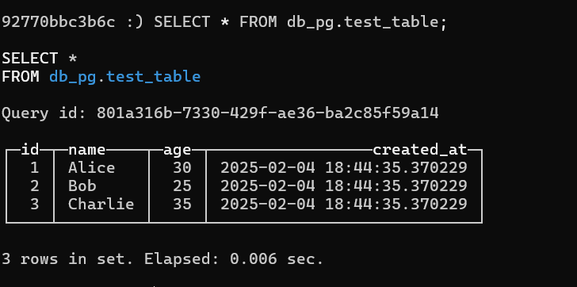

### **Шаги выполнения**

   Откройте терминал в директории с [docker-compose.yml](docker-compose.yml) и выполните команду:

   ```bash
   docker-compose up -d
   ```
#### 1. Инициализация PostgreSQL
Подключитесь к PostgreSQL и создайте тестовую таблицу. Выполните следующие команды:

```bash
docker exec -it postgres_container psql -U postgres -d test_db
```

Внутри PostgreSQL выполните:

```sql
CREATE TABLE IF NOT EXISTS test_table (
    id SERIAL PRIMARY KEY,
    name VARCHAR(100),
    age INT,
    created_at TIMESTAMP DEFAULT CURRENT_TIMESTAMP
);

INSERT INTO test_table (name, age) VALUES 
('Alice', 30),
('Bob', 25),
('Charlie', 35);
```

Теперь у нас есть таблица `test_table` с тестовыми данными.

---

#### 2. Запрос данных из PostgreSQL через ClickHouse

На стороне ClickHouse выполните запрос к PostgreSQL с помощью функции `postgres`. Сначала подключитесь к ClickHouse:

```bash
docker exec -it clickhouse_container clickhouse-client
```

Затем выполните запрос:

```sql
SELECT *
FROM postgres('postgres:5432', 'test_db', 'test_table', 'postgres', 'mysecretpassword');
```

Вы должны увидеть данные из таблицы `test_table`.

---

#### 3. Создание таблицы в ClickHouse с движком `PostgreSQL`

Создайте таблицу в ClickHouse, которая будет интегрирована с PostgreSQL:

```sql
CREATE TABLE test_table_pg
(
    id UInt32,
    name String,
    age UInt8,
    created_at DateTime
)
ENGINE = PostgreSQL('postgres:5432', 'test_db', 'test_table', 'postgres', 'mysecretpassword');
```

Теперь вы можете выполнять запросы к этой таблице:

```sql
SELECT * FROM test_table_pg;
```

---

#### 4. Создание базы данных в ClickHouse с движком `PostgreSQL`

Создайте базу данных в ClickHouse, которая будет связана с PostgreSQL:

```sql
CREATE DATABASE db_pg
ENGINE = PostgreSQL('postgres:5432', 'test_db', 'postgres', 'mysecretpassword');
```

После создания базы данных вы можете обращаться к таблицам PostgreSQL напрямую:

```sql
SELECT * FROM db_pg.test_table;
```
