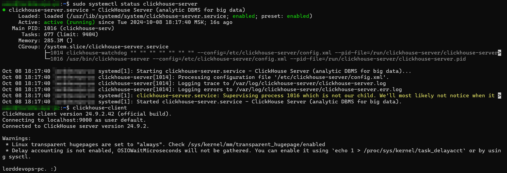
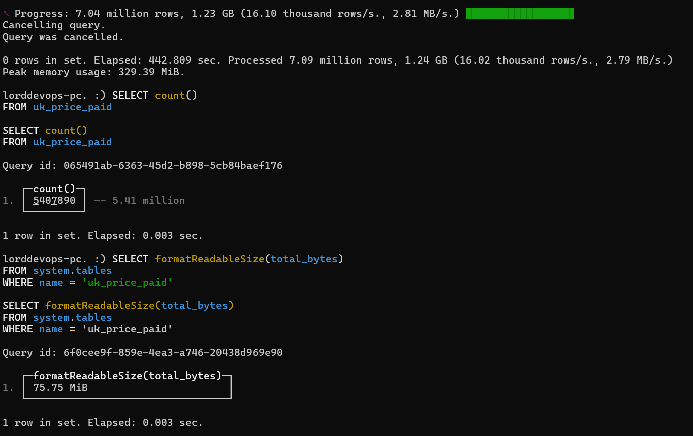
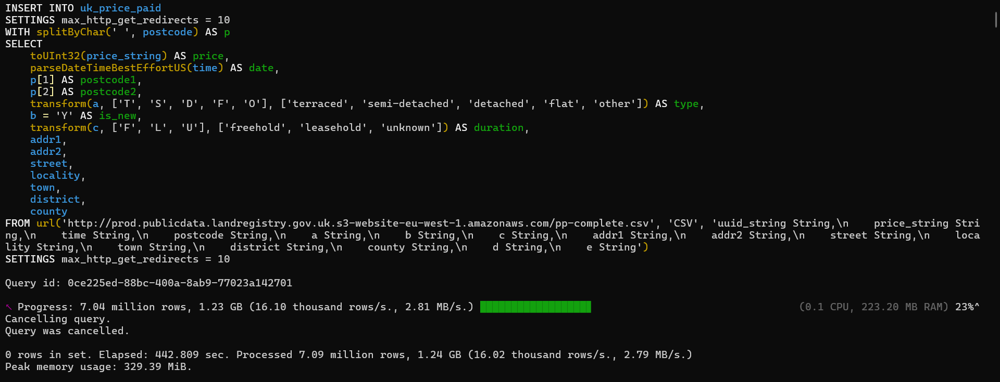
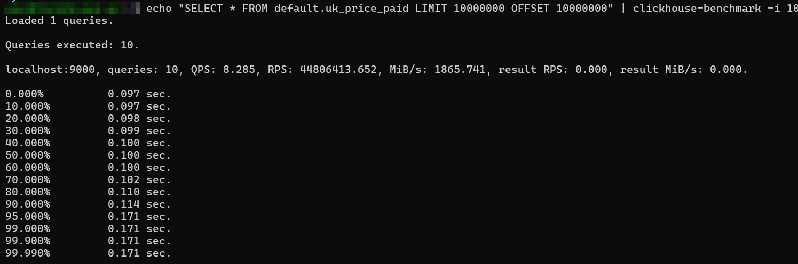
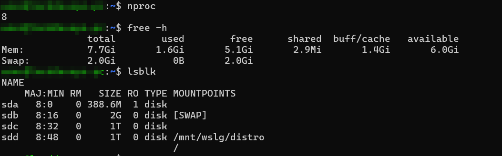
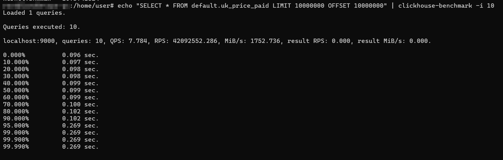

# Настройка сервера и ClickHouse





## Первая проверка



## Добавление настроек


### Увеличение количества открытых файловых дескрипторов

```bash
sudo nano /etc/security/limits.conf
```

```plaintext
* soft nofile 100000
* hard nofile 100000
```

### Увеличение объема разделяемой памяти

```bash
sudo nano /etc/sysctl.conf
```

```plaintext
kernel.shmmax = 1073741824
```

## Вторая проверка

