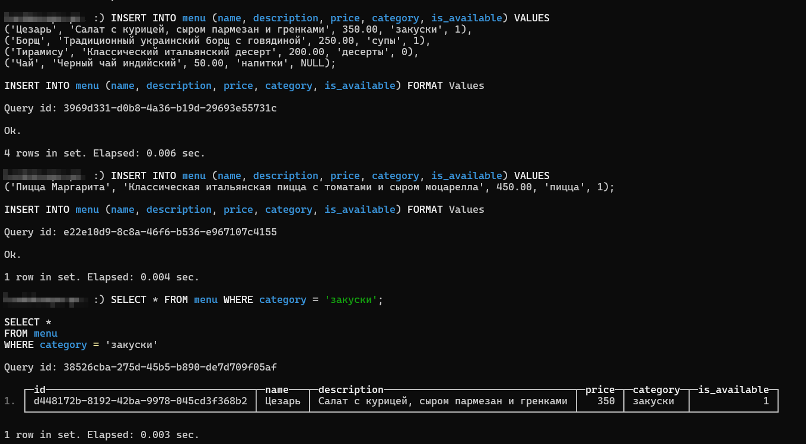
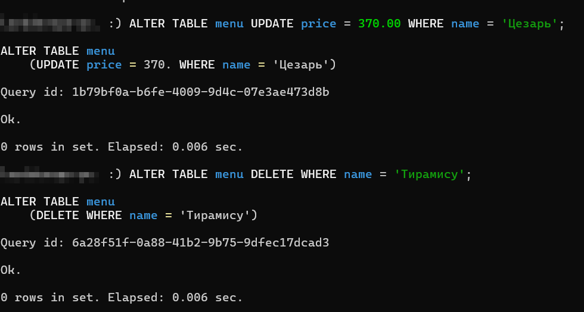
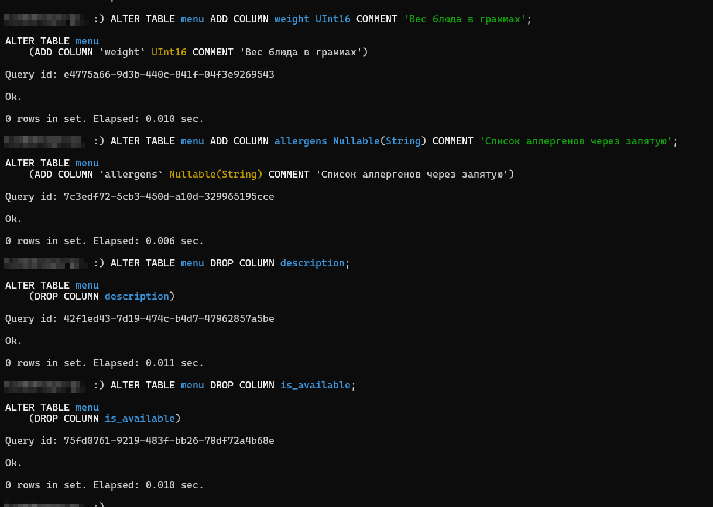
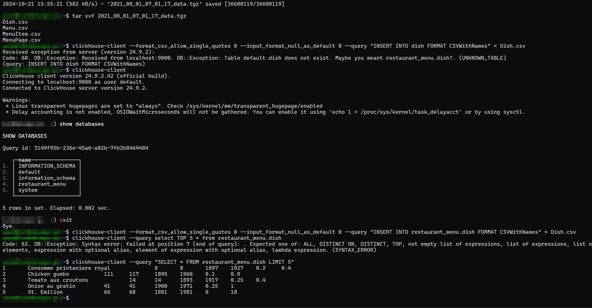
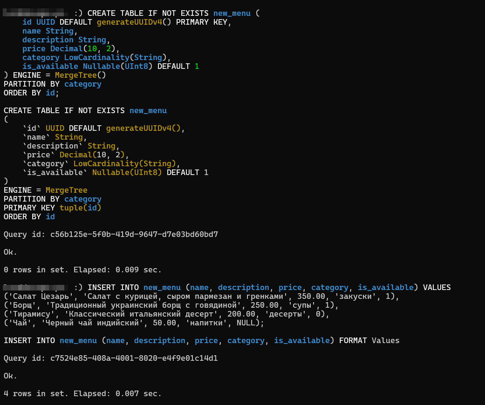
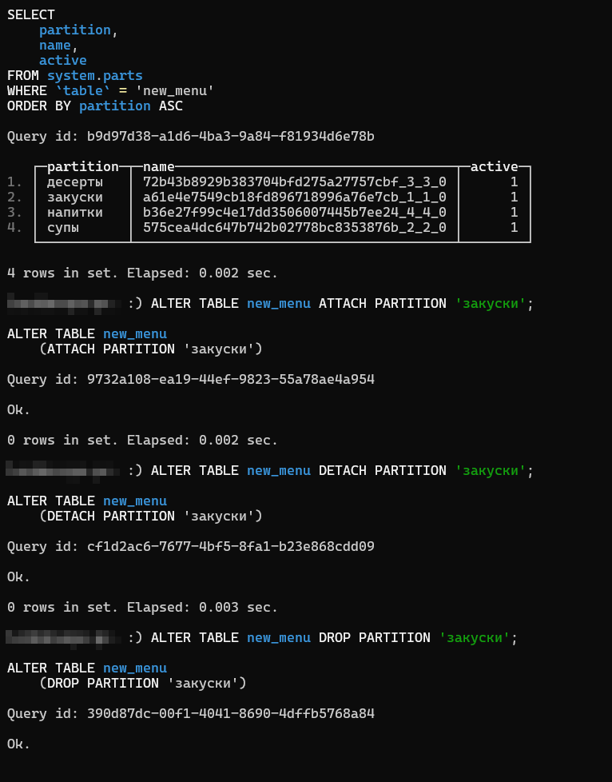
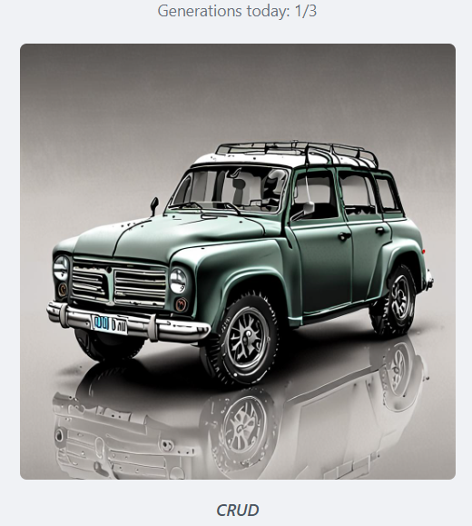

# Работа с SQL в ClickHouse

В этом документе описаны SQL-запросы для работы с ClickHouse в контексте бизнес-кейса "Меню ресторана". 

 Все SQL-запросы собраны в файл [request_storage](./request_storage).

## пруфы

## работа с датасетом

 Скачать пример датасета можно [здесь](./sample_dataset.tgz).

## Чистый фан - результат генерации изображения по промту CRUD

2й прям зашёл)))

